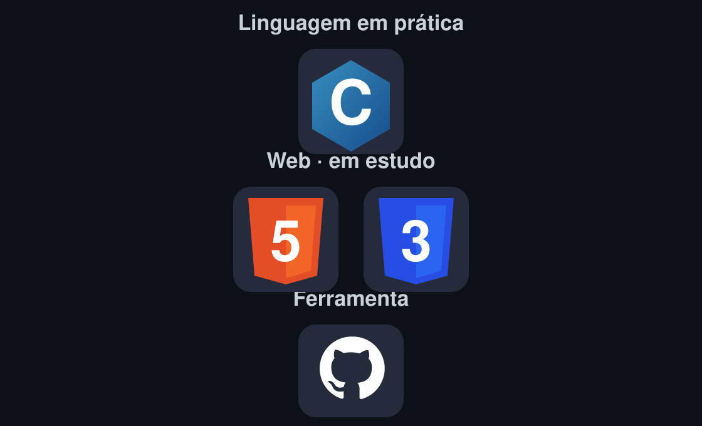

<div align="center">
  
  <br /><br />
  <a href="https://github.com/eufilip">GitHub</a> &nbsp;·&nbsp;
  <a href="https://www.linkedin.com/in/2602b1373/">LinkedIn</a> &nbsp;·&nbsp;
  ADS no IFBA
</div>

## 👨‍💻 /whoami

Sou **Filipe Reis**, estudante de **Análise e Desenvolvimento de Sistemas no IFBA**, em Salvador. Estou construindo minha base em programação com C e lógica, explorando desenvolvimento web e organizando meus estudos em projetos. Tenho experiência com organização de documentos, design e atendimento a clientes.

```js
const filipe = {
  local: "Salvador, Bahia",
  formacao: "ADS · IFBA",
  praticaAtual: ["Lógica de programação", "C"],
  estudando: ["HTML", "CSS", "Desenvolvimento web"],
  interesses: ["Software", "Soluções digitais"],
  objetivo: "Oportunidade de estágio em tecnologia"
};
```

## 🛠️ Tech Stack

<div align="center">
  
</div>

## 📊 GitHub

<div align="center">
  <a href="https://github.com/eufilip?tab=overview">Contribuições</a> &nbsp;·&nbsp;
  <a href="https://github.com/eufilip?tab=repositories">Repositórios</a>
</div>

## 📫 Vamos conversar

<div align="center">
  <a href="https://www.linkedin.com/in/2602b1373/">LinkedIn</a> &nbsp;·&nbsp;
  <a href="https://github.com/eufilip">GitHub</a>
</div>

<br />

<div align="center"></div>
